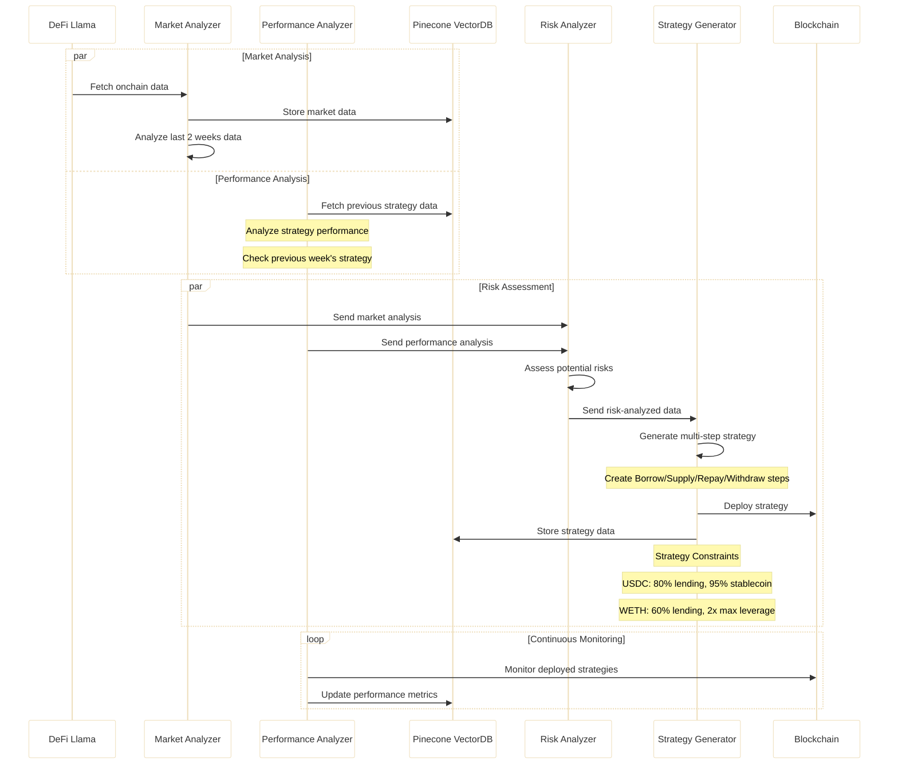
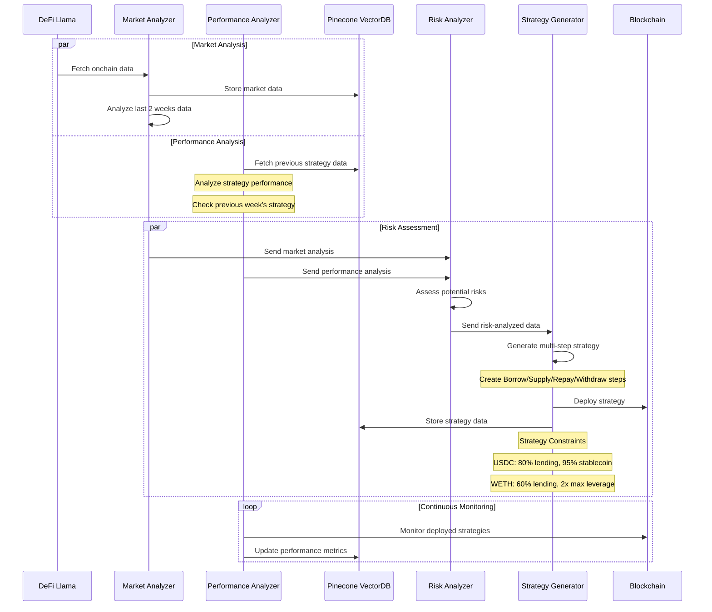

# LiqAI

Liquid AI Agent Curator is an automated system that acts as a DeFi strategy curator, analyzing market conditions to create and optimize yield strategies for USDC and WETH on Base using the Liquid protocol. The system leverages artificial intelligence to generate multi-step strategies while continuously monitoring performance and managing risk.

## Overview

DeFi (Decentralized Finance) has unlocked a world of opportunities—yield farming, lending, borrowing, liquidity mining—but it remains complex for many. Managing multiple protocols, keeping track of TVL changes, APYs, and risk metrics demands considerable time and expertise.

The Liquid AI Agent Curator exists to bridge this gap, providing:

- Automated data retrieval & analysis (e.g., from DeFi Llama).
- AI-based risk profiling to avoid illiquid or volatile positions.
- Multi-step DeFi strategies with minimal user overhead (e.g., supply, borrow, repay, leverage).
- Continuous performance monitoring and future strategic refinements.

### Why Now?

- Rapidly evolving DeFi: Protocols emerge daily with new yield opportunities. AI-driven curation helps filter out noise and identify robust strategies quickly.
- Reducing complexity: Users often juggle multiple tabs, wallets, yield calculators, etc. Automated workflows streamline the entire cycle—from data collection to final deployment.
- Enhancing accessibility: By providing a user-friendly AI agent, new entrants can safely experience DeFi without needing in-depth expertise about lending, leveraging, or risk management.

## Components

Below is a breakdown of major layers and modules in the Liquid AI Agent Curator:

### Data Layer

- Pulls raw metrics (TVL, APYs, liquidity, price feeds) from providers like DeFi Llama or other aggregator services.
- Stores both raw and processed data in Pinecone Vector DB for historical lookups and vector-based queries (e.g., similarity searches).

### Analysis Layer

- Market Analyzer: Aggregates on-chain data, focusing on 2-week intervals to spot yield trends, stable APYs, or sudden shifts.
- Performance Analyzer: Evaluates existing strategies (did they meet target APY? Any liquidation events?).
- Risk Analyzer: Takes combined outputs, checks for protocol health (liquidity), potential high-volatility assets, or over-leveraging.

### Orchestration Layer

- Strategy Generator: Synthesizes final multi-step plans (supply, borrow, repay, etc.) under user-defined rules (e.g., "≥80% stablecoin exposure," "≤2x leverage").
- Event Manager: Coordinates scheduled tasks (like "run every Monday") or responds to external triggers.

### Deployment Layer

- Liquid Protocol Integration: Once a strategy is approved, the agent deploys it on Base, interacting with the Liquid Protocol's smart contracts.
- Blockchain Execution: Actual transactions occur here (deposit collateral, borrow tokens, etc.).

### Monitoring & Feedback

- Continuous monitoring of deployed strategies.
- Logs updated metrics into Pinecone DB.
- Provides real-time or scheduled updates to users (via UI, Telegram mini app, or API).

### System Workflow

The following sequence diagram illustrates the detailed interaction flow between system components:



#### Process Steps



#### Process Steps

1. Fetch Data: Retrieve on-chain stats, store them in Pinecone (alongside older data for historical context).
2. Parallel Analysis:
   - Market: Evaluate yields, volatility.
   - Performance: Check existing strategies' success/failure.
   - Risk Check: Integrate both analyses into a risk profile.
3. Strategy Generation: Build or adjust strategies (borrow/supply, stablecoin or leveraged positions).
4. Deploy: Publish final steps on Base using the Liquid Protocol.
5. Monitor & Iterate: Keep watch for changes, generate a performance report, and potentially re-tune after a set interval.

### Core Tools & Integrations

1. LangGraph & LangChain
   These core technologies manage the complex workflow and orchestration of all agents within the system. They handle comprehensive state management and agent interactions while providing robust tool integration and prompt handling capabilities for smooth system operation.

2. Vector Database (Pinecone)
   Pinecone serves as the system's memory, storing crucial strategy and market data for quick retrieval. The database enables sophisticated pattern recognition and maintains detailed performance history while supporting comprehensive risk analysis through its vector search capabilities.

3. DeFi Llama
   This integration provides essential protocol data aggregation and market analysis support for the system. It delivers crucial performance metrics tracking and assists in thorough risk assessment through its comprehensive protocol data coverage.

4. Liquid Protocol
   As the foundational DeFi infrastructure, the Liquid Protocol enables sophisticated strategy deployment and provides a robust decentralized execution framework for all system operations.

5. AWS Bedrock

### Example Flow

Here is a simplified scenario:

Monday 00:00 UTC:

- A scheduled task triggers the Market Analyzer to gather data from DeFi Llama for the previous 2 weeks.
- Performance Analyzer checks if last week's strategies performed well or faced any liquidations.
- Both results feed into the Risk Analyzer, which flags any concerns.

Strategy Generator:

- Finds an updated USDC yield farm offering 5% APY with low risk.
- Decides to shift a portion of the user's stablecoin holdings there.
- For WETH, identifies a slight drop in volatility, so a 1.5x leverage strategy might be prudent.

Deployment:

- The new multi-step plan is deployed: "Supply USDC → Borrow small portion → Re-supply stablecoin to gain better yield."
- On the WETH side: "Deposit WETH → Borrow WETH → Re-deposit to earn yield," respecting a max of 2x leverage.

Monitoring:

For the rest of the week, the system continuously tracks performance, logs data in Pinecone, and stands by for next Monday's in-depth analysis or urgent triggers if markets drastically change.

### Future Directions

Advanced Risk Modeling

- Incorporating volatility measures and real-time liquidation risk in the agent's calculations.

Social Graph & User Profiles

- Users can follow top-performing strategies or "curators," building a social layer around strategy sharing.

Multi-Chain Expansion

- Integrate additional L2s or other EVM chains for broader yield opportunities.

Adaptive Strategies

- Auto-balancing or reallocation triggers, minimizing user manual interventions even further.

Mini Telegram App

- Chat-based interface to query performance stats or tweak leverage on the fly.

### Getting Started

Clone the Repo

```bash
git clone https://github.com/YOUR-ORG/liquid-ai-agent.git
cd liquid-ai-agent
```

Install Dependencies

```bash
npm install
# or
pip install -r requirements.txt
```

Configure Environment

Create a .env file for Pinecone, DeFi Llama, or other keys.
Example:

```makefile
OPENAI_API_KEY=xxxxxxxxx
PINECONE_INDEX_NAME=liq-ai
PINECONE_API_KEY=xxxxxxxxx
PINECONE_ENVIRONMENT=us-east-1
PRIVATE_KEY=xxxxxxxxxxxxx
BASE_RPC_URL=https://base-mainnet.infura.io/v3/xxxxxxxxxxxxxxxxxxx
```

Run

```bash
npm start
# or
python main.py
```

Observe

Monitor console logs or any local dashboards to see how the system is fetching data and generating strategies.

## Contributing

Contributions of all sizes are welcome:

- Bug Reports/Feature Requests: Submit via GitHub Issues.
- Pull Requests: Fork the repo, create a feature branch, push changes, and open a PR.
- Discussion: Join our community channels (Discord, Telegram) to brainstorm ideas and get support.

Please ensure consistency with code formatting/linting rules before submitting a PR.

## Disclaimer

This system is under development and should be used with appropriate risk management measures in the DeFi space.
